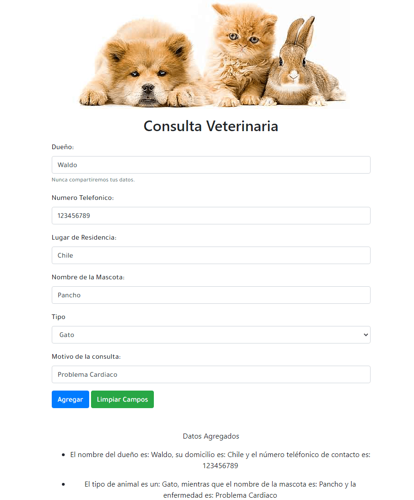
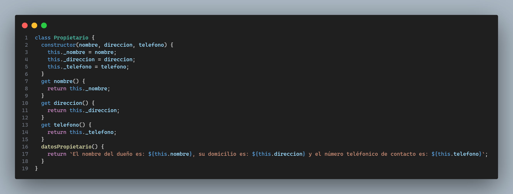

Este repositorio contiene el código de mi solución al **tercer desafío** llamado Lista de Animales el cual no es evaluado del módulo 4: **Programación avanzada en JavaScript** de la beca Desarrollo de aplicaciones **Full Stack Javascript Trainee V2.0** dictada por Desafío Latam.

Los requisitos del desafío son los siguientes:

El proyecto mostrando lo requerido lo muestro en la siguiente imagen:

# Requerimientos cumplidos

### 1. Crear las clases en ES6 respetando la Herencia indicada en el diagrama de clases

He creado en el archivo llamado **modulos.js** las siguientes clases:

-Clase **Propietario**

-Clase **Animal** que extiende de la Clase **Propietario**

-Clase **Mascota** que extiende de la clase **Animal**

-Clase **Consulta** que extiende de la clase **Mascota**

### 2. Crear los métodos get y set para la clase de mascota

He creado ambos métodos como muestro en la imagen siguiente:

### 3. Crear un método get para la clase Animal de la propiedad tipo para retornar el mensaje “El tipo de animal es un: ${this.tipo}”.

He creado el método get para la clase Animal como muestro en la imagen siguiente:

### 4.Crear el método “datosPropietario” en la clase correspondiente y que pueda ser accedido desde las clases inferiores.

He implementado el método datosPropietario en la clase Propietario el cual muestra el mensaje solicitado:

### 5.Captar los elementos del formulario con JavaScript e identificar el tipo de animal para realizar la instancia dependiendo del tipo de animal seleccionado. Es decir, si el usuario selecciona Gato, la instancia a crear para la clase Mascota debe tener el nombre de “Gato”, si selecciona Perro, la instancia de Mascota deberá llamarse “Perro”.

He creado una función dedicada a realizar lo anterior llamada **crearObjetoConsulta** la cual muestro a continuación:

### 6.Mostrar a modo de lista los mensajes resultantes para el método “datosPropietario” cuando el usuario haga un clic sobre el botón Agregar, accediendo a los métodos get de las clases Animal y Mascota, concatenando todo en un solo mensaje,

He creado una función dedicada a realizar lo pedido llamada **mostrarDataEnHTML** la cual necesita como argumento un objeto de la clase Consulta. A continuación muestro dicho función:

